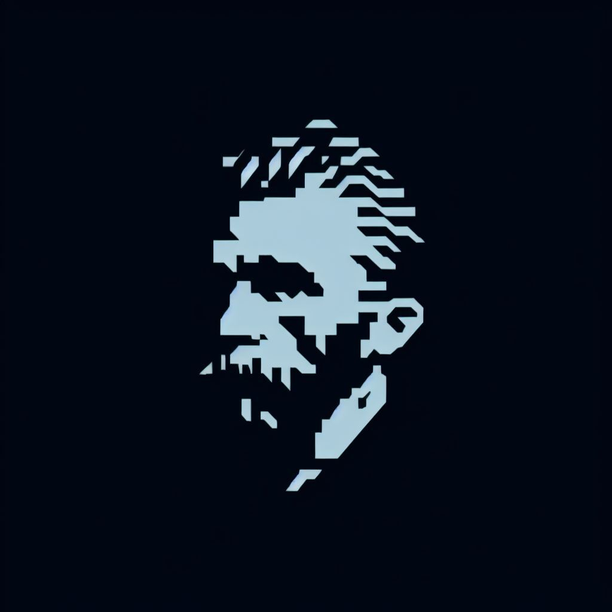
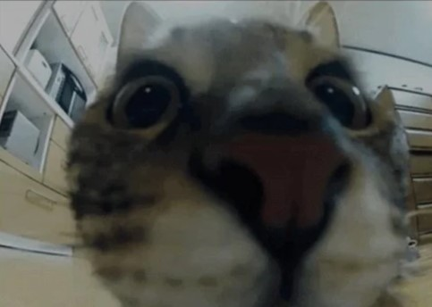

#### 
Hide any type of files inside a image of your choice

  

  
    

   

  
  
  

---

# Table of Contents

- [Features](#features)
- [How it works](#how-it-works)
- [Installation](#installation)
- [Usage](#usage)
- [License](#license)
- [Contributing](#contributing)

| File to hide | Cover image | Cover with file hidden |
|-----------|-----------| -----------|
|  |  |  |
| This is the file that we want to hide inside the image | This is the image that we want to hide the file inside | This is the cover image with the file inside |

# Features   

- **File Hiding:** Hide any type of file within an image of your choice, without altering the image's visual appearance.
- **Decoding Capability:** Decode hidden files from images.
- **Image Comparison:** Visualize the difference between two images.
- **Detailed Logging:** Create a log file that records comprehensive information about the program's execution.
- **Command-Line Interface (CLI):** Offers a developer-friendly mode with command-line options for more advanced usage.
- **User Interface (UI):** Provides a simpler and intuitive mode for non-developer users.
- **Open After Decoding:** Automatically open the decoded file after extracting it from the image.
- **Cross-Platform:** Works on Windows, Linux, and macOS.
- **Free and Open-Source:** Van Gonography is completely free and open-source, and will always be.
- **Encryption:** Encrypt the hidden file with a password of your choice.
- **Compression:** Compress the hidden file to reduce its size.
- **Multiple Files:** Hide multiple files inside an image.
- **Stealth Mode:** Hide the fact that the image contains a hidden file.
- **User settings:** Save your preferences for future use.

